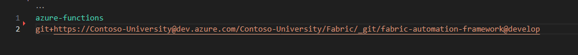
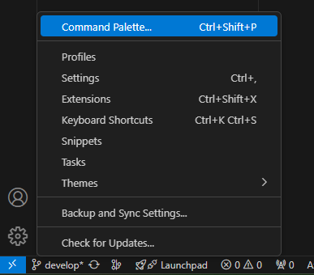
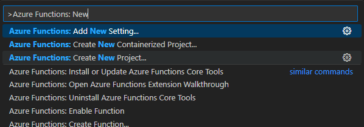
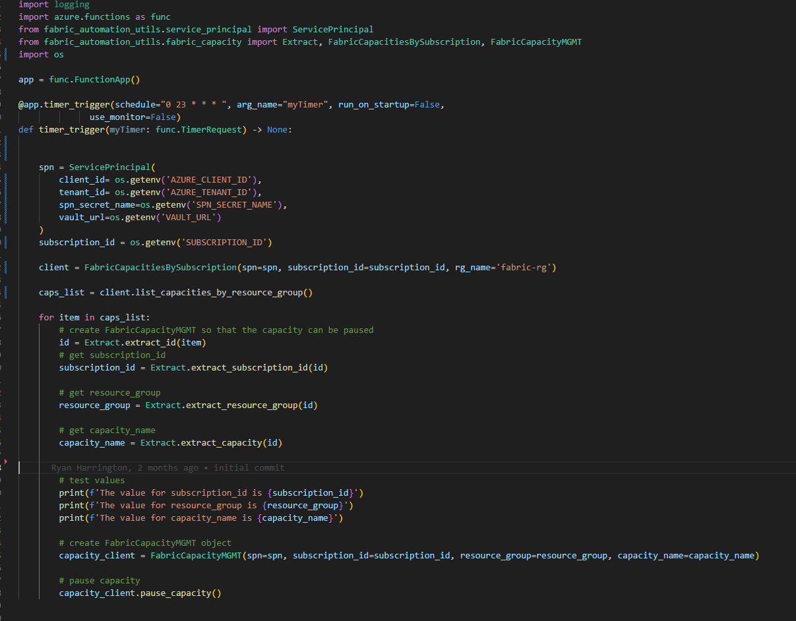
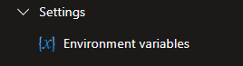
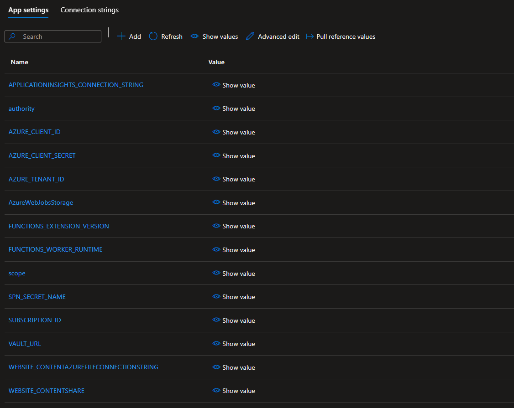
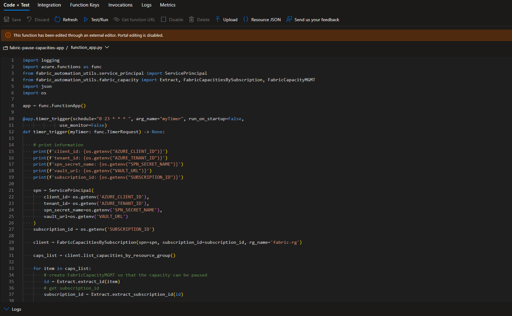

# Fabric Pause Capacity App
Note that this project is for POC purposes only.  Please see DISCLAIMER.md for more details


This Sample Code is provided for the purpose of illustration only and is not intended to be used in a production environment.
THIS SAMPLE CODE AND ANY RELATED INFORMATION ARE PROVIDED "AS IS" WITHOUT WARRANTY OF ANY KIND, 
EITHER EXPRESSED OR IMPLIED, INCLUDING BUT NOT LIMITED TO THE IMPLIED WARRANTIES OF MERCHANTABILITY 
AND/OR FITNESS FOR A PARTICULAR PURPOSE.  We grant You a nonexclusive, royalty-free right to use and 
modify the Sample Code and to reproduce and distribute the object code form of the Sample Code, provided that 
You agree: (i) to not use Our name, logo, or trademarks to market Your software product in which the Sample Code
is embedded; (ii) to include a valid copyright notice on Your software product in which the Sample Code is embedded;
and (iii) to indemnify, hold harmless, and defend Us and Our suppliers from and against any claims or lawsuits, 
including attorneys’ fees, that arise or result from the use or distribution of the Sample Code.


A function app for pausing fabric capacities

## Table of Contents

- [Introduction](#introduction)
- [Repository layout](#repository-layout)
- [Environments](#environments)
- [Local development](#local-development)
- [CI/CD](#cicd)
- [Features](#features)
- [Installation](#installation)
- [Usage](#usage)
- [Contributing](#contributing)
- [License](#license)

## Introduction

This is a function app aimed at setting a function app at a certain time to trigger and pausing all capacities in that resource group to reduce spend

It runs deliberately *outside* Fabric, so the thing that resumes a capacity can
never be taken down by the capacity being paused. Two timer triggers:

| Function | Schedule (NCRONTAB, 6-field) | Action |
|---|---|---|
| `pause_capacities` | `0 0 23 * * *` | Every night at 23:00 — pauses every capacity in `FABRIC_RESOURCE_GROUP` |
| `resume_capacities` | `0 0 8 * * 1-5` | Mon–Fri at 08:00 — resumes only the capacities in `RESUME_CAPACITIES`, waits for `Active`, optionally health-checks Airflow |

Pause acts on **every capacity in `FABRIC_RESOURCE_GROUP`**. That variable is the
app's entire blast radius — it is the single most important setting here.

Resume is deliberately narrower. `RESUME_CAPACITIES` (Terraform variable
`resume_capacities`, `uswest3capacity` in prod) is a comma-separated allow-list;
anything omitted is still paused nightly and stays paused until someone resumes
it by hand. An empty list resumes nothing, which is the intended fail-safe
direction — a typo costs a manual resume rather than a day of F-SKU spend.

The two schedules are also asymmetric in *days*, on purpose. Pause runs seven
days a week so a capacity resumed by hand on a Saturday cannot bill through to
Monday; resume is weekdays only, so a weekend capacity has to be started
deliberately.

### Timezone

Both schedules are evaluated in `WEBSITE_TIME_ZONE` (Terraform variable
`website_time_zone`), set to **`America/New_York`**. `08:00` therefore means
08:00 Eastern, and stays at 08:00 local across the DST boundary.

> This is a **Linux** Flex Consumption app, so the value must be a tz-database
> name. The Windows ID `Eastern Standard Time` is accepted without complaint and
> then ignored, leaving the host on UTC — which is how the resume once ran at
> 04:00 Eastern and started every capacity in the group hours before anyone was
> awake to notice. A `validation` block on the variable now rejects any value
> without a `/` in it.

## Repository layout

```
src/function/     Deployment package (function_app.py, host.json, requirements.txt)
  capacity_ops/   Pause/resume logic; function_app.py holds only the triggers
iac/              Terraform: Function App, storage, telemetry, RBAC, alerts, test capacity
  envs/           Per-environment tfvars (test, prod)
  backends/       Per-environment remote state config
tests/            pytest suite; tests/integration/ is opt-in (-m integration)
scripts/          Operator tools (manual pause check, test-capacity pause)
.cicd/            Azure DevOps pipeline
docs/             Runbooks, including terraform-import.md
```

## Environments

| | TEST | PROD |
|---|---|---|
| Resource group | `test-capacity-pause-app-rg` | `fabricpausecapacitiesapp` |
| Function App | `fabric-pause-capacities-test` | `fabric-pause-capacities-flex` |
| Capacities managed | `test-capacity-pause-app-rg` (self-contained) | `fabric-rg` |
| Test capacity | `fabpausetestcap` (F2) | none |

The TEST environment owns a persistent F2 capacity as its pause/resume target.
Terraform creates it if absent and **never destroys it** (`prevent_destroy`); the
pipeline pauses it after every run, so it costs nothing while idle.

Because TEST manages only its own resource group, no test run can reach a
production capacity. The integration tests assert this before doing anything.

## Local development

```powershell
python -m venv .venv
.\.venv\Scripts\Activate.ps1
pip install -r requirements-dev.txt -r src/function/requirements.txt

pytest                  # unit tests only; integration excluded by default
ruff check .
black --check .

cd iac; terraform fmt -check -recursive; terraform validate
```

Integration tests need a deployed TEST stack and are opt-in:

```powershell
pytest -m integration
```

> **Note:** `scripts/manual_pause_check.py` really does pause capacities. It was
> previously named `test_fa_code.py`, which meant `pytest` collected it and
> paused every capacity in the subscription at import time. It now requires an
> explicit `--resource-group` and supports `--dry-run`.

## CI/CD

`.cicd/fabric-pause-capacity-app-cicd.yml` — four stages:

1. **Validate** — ruff, black, mypy (advisory), pytest with an 80% coverage gate;
   `terraform fmt -check` and `validate`.
2. **DeployTest** — `terraform apply` to TEST, then live integration tests that
   pause and resume the real F2 through the deployed app's admin API.
3. **PauseTestCapacity** — `always()`; pauses the F2 even when tests failed, since
   that is exactly when it is most likely to be left billing.
4. **DeployProd** — gated on the `fabric-prod` environment approval and on `main`
   or `release/*`. Publishes the plan as an artifact and applies that exact file.

Prod resources were built by hand; see [docs/terraform-import.md](docs/terraform-import.md)
for adopting them into Terraform state and the diffs to expect on first plan.

## Features


## Installation

Follow the steps at this other github page: https://github.com/RyanMicrosoftContosoUniversity/fabric-utils to ensure all dependencies are in place


Creation of a new function app via VS Code (note, this can be created and updated in the Azure Portal as well)




Ensure that the Azure extension is installed from the VS Code Marketplace

To create a new function app, first navigate to the command pallette





Create a new project for Azure Functions





Add code to function app


Use a similar flow with the command pallette to publish app to Azure

Add Environment Variables for the app





Test the app


